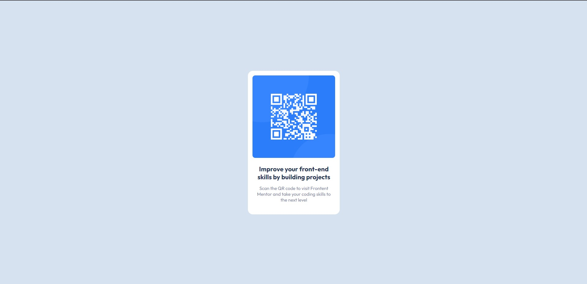

# Frontend Mentor - QR code component solution

This is a solution to the [QR code component challenge on Frontend Mentor](https://www.frontendmentor.io/challenges/qr-code-component-iux_sIO_H). Frontend Mentor challenges help you improve your coding skills by building realistic projects.

## Table of contents

-   [Screenshot](#screenshot)
-   [Links](#links)
-   [BuildWith](#built-with)
-   [Author](#author)

### Screenshot

### Links

-   Solution URL: [GitHub](https://github.com/SafetKaric/qr-code-reader-main.git)
-   Live Preview URL: [Vercel](https://qr-code-reader-main-704tdy6wg-safetkaric.vercel.app/)

### Built with

-   Semantic HTML5 markup
-   CSS
-   Flexbox

## Author

-   Website - [SafetKaric](https://github.com/SafetKaric)
-   Frontend Mentor - [@SafetKaric](https://www.frontendmentor.io/profile/SafetKaric)
